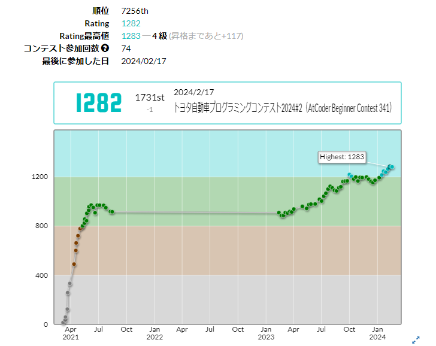
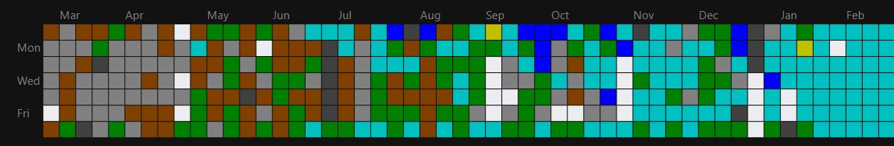

# この記事に書いてあること

レートのグラフを見ればわかる通り、2021年の夏から2023年の頭までコンテストに出てませんでした。精進もほぼしておらず、実質休止期間です。

**復帰した以降** について、
- 環境の整備
- 解いた問題
- 学んだこと

を書きます。

なんで休止以前を省くかって言うと、あんま意味なさそうだからです。

この辺も別の記事でそのうち話せればと思いますが、2021年に入緑しているものの、大した知識はなかったです。

覚えている範囲だと、学んでいたのは BFS/DFS/二分探索/尺取法/imos法/ダイクストラ法 とかそんな感じだったと思います。学んでいた、と言っても、使いこなせているわけでは全然なくて、触れたことがある、程度だったと思います。[difficultyが年間50くらい厳しくなってる](https://twitter.com/chokudai/status/1665714185320419328)という話もあるらしく、休止前の話はレベル感を考えてもあまりアテにできないかなと思っております。緑になれたのも、ABC-C までの早解きがそこそこ得意だったからというだけですし。

そんなわけで、休止前の話はまた別の機会に。

# 環境の整備
## コーディング環境
実は休止期間前までは AtCoder のコードテストしか使ってませんでした。復帰して1か月ぐらいでしたかね、なんとなく「プログラマとして飯食ってるのに手元に環境構築もできないのヤバくないか？」という不安もあり、ローカル環境の整備をしようということになりました。具体的にやったことは、
- VSCode の導入
- WSL の導入
- ACL の導入

です。

構築に当たっては [こちら](https://iconcreator.hatenablog.com/entry/2021/09/19/200000) に大変お世話になりました。コンピュータへの理解よわよわマンとしては1から10まで説明してくれるこの記事が非常にわかりやすくありがたかった記憶があります（それでもトラブってある程度手間取りましたが……）。

breakpoint を用いた debug は業プロでもよくやりますし、これできるようになったのが一番嬉しかったかもしれないですね。あとはシンタックスハイライトとか、インデントの設定できるとか、補完が効くとか、まあそんなぐらいです。

## ブラウザ プラグイン
[AtCoder Easy Test](https://greasyfork.org/en/scripts/433152-atcoder-easy-test-v2) と [ac-predictor](https://greasyfork.org/en/scripts/369954-ac-predictor) を入れました。

前者に関しては atcoder-tools とか atcoder-cli & online-judge-tools を使ってもいいのでしょうけど、現状がそこそこ快適なのでなおざりにしております……

## テンプレート整備
休止前は
```cpp
#include <bits/stdc++.h>
using namespace std;
```
しか使っていませんでした。

今は
```cpp
#include <bits/stdc++.h>
#include <atcoder/all>
using namespace std;
using namespace atcoder;
using ll = long long;
using mint = modint998244353;
const int INF = 1001001001;
const ll LINF = 6001001001001001001;
const int MOD = 998244353;
#define reps(i, a, n) for (ll i = (a); i < (ll)(n); ++i)
#define rep(i, n) reps(i, 0, n)
#define all(a) (a).begin(), (a).end()
template<typename T> bool chmin(T& a, T b){if(a > b){a = b; return true;} return false;}
template<typename T> bool chmax(T& a, T b){if(a < b){a = b; return true;} return false;}
template <typename T> istream &operator>>(istream &is, vector<T> &v) {for (T &in : v)is >> in;return is;}
```
を使ってます。`ll` と `rep` は特に使用頻度が高いです。

# 解いた問題
復帰後～入水までの間に解いた問題の内、difficulty が茶色以上のものを抽出しました。精進の指針の一端でも担えればと思います。
<details>
  <summary>2024-01</summary>
  <div>

  - 水 [D. equeue](https://atcoder.jp/contests/abc128/tasks/abc128_d)
  - 緑 [E. Art Gallery on Graph](https://atcoder.jp/contests/abc305/tasks/abc305_e)
  - 水 [E. Dividing Chocolate](https://atcoder.jp/contests/abc159/tasks/abc159_e)
  - 水 [E. Non-Decreasing Colorful Path](https://atcoder.jp/contests/abc335/tasks/abc335_e)
  - 水 [F. Sugoroku](https://atcoder.jp/contests/abc146/tasks/abc146_f)
  - 茶 [D. Loong and Takahashi](https://atcoder.jp/contests/abc335/tasks/abc335_d)
  - 茶 [C. Loong Tracking](https://atcoder.jp/contests/abc335/tasks/abc335_c)
  - 茶 [B. log](https://atcoder.jp/contests/arc109/tasks/arc109_b)
  - 緑 [E. Sequence Sum](https://atcoder.jp/contests/abc179/tasks/abc179_e)
  - 緑 [E. Peddler](https://atcoder.jp/contests/abc188/tasks/abc188_e)
  - 緑 [E. Unique Color](https://atcoder.jp/contests/abc198/tasks/abc198_e)
  - 緑 [E. Souvenir](https://atcoder.jp/contests/abc286/tasks/abc286_e)
  - 緑 [E. Count Simple Paths](https://atcoder.jp/contests/abc284/tasks/abc284_e)
  - 緑 [E. Train](https://atcoder.jp/contests/abc192/tasks/abc192_e)
  - 緑 [E. Crystal Switches](https://atcoder.jp/contests/abc277/tasks/abc277_e)
  - 緑 [E. Round Trip](https://atcoder.jp/contests/abc276/tasks/abc276_e)
  - 緑 [E. Grid Filling](https://atcoder.jp/contests/abc278/tasks/abc278_e)
  - 緑 [C. Repsept](https://atcoder.jp/contests/abc174/tasks/abc174_c)
  - 緑 [E. This Message Will Self-Destruct in 5s](https://atcoder.jp/contests/abc166/tasks/abc166_e)
  - 緑 [D. Not Divisible](https://atcoder.jp/contests/abc170/tasks/abc170_d)
  - 緑 [D. Draw Your Cards](https://atcoder.jp/contests/abc260/tasks/abc260_d)
  - 水 [F. Regular Triangle Inside a Rectangle](https://atcoder.jp/contests/abc292/tasks/abc292_f)
  - 水 [F. Teleporter and Closed off](https://atcoder.jp/contests/abc291/tasks/abc291_f)
  - 水 [E. Bishop 2](https://atcoder.jp/contests/abc246/tasks/abc246_e)
  - 青 [E. Magical Ornament](https://atcoder.jp/contests/abc190/tasks/abc190_e)
  - 水 [E. Traveling Salesman among Aerial Cities](https://atcoder.jp/contests/abc180/tasks/abc180_e)
  - 水 [E. Count Median](https://atcoder.jp/contests/abc169/tasks/abc169_e)
  - 水 [E. Traveler](https://atcoder.jp/contests/abc197/tasks/abc197_e)
  - 水 [F. Silver Fox vs Monster](https://atcoder.jp/contests/abc153/tasks/abc153_f)
  </div>
</details>

<details>
  <summary>2023-12</summary>
  <div>

  - 緑 [E. Christmas Color Grid 1](https://atcoder.jp/contests/abc334/tasks/abc334_e)
  - 茶 [D. Reindeer and Sleigh](https://atcoder.jp/contests/abc334/tasks/abc334_d)
  - 緑 [C. Socks 2](https://atcoder.jp/contests/abc334/tasks/abc334_c)
  - 茶 [B. Christmas Trees](https://atcoder.jp/contests/abc334/tasks/abc334_b)
  - 水 [E. Sugoroku 4](https://atcoder.jp/contests/abc275/tasks/abc275_e)
  - 水 [E. Traveling Salesman among Aerial Cities](https://atcoder.jp/contests/abc180/tasks/abc180_e)
  - 青 [E. Rotation Matching](https://atcoder.jp/contests/abc165/tasks/abc165_e)
  - 青 [D. Project Planning](https://atcoder.jp/contests/abc227/tasks/abc227_d)
  - 茶 [C. ABC conjecture](https://atcoder.jp/contests/abc227/tasks/abc227_c)
  - 緑 [E. Takahashi Quest](https://atcoder.jp/contests/abc333/tasks/abc333_e)
  - 茶 [D. Erase Leaves](https://atcoder.jp/contests/abc333/tasks/abc333_d)
  - 緑 [E. Transformable Teacher](https://atcoder.jp/contests/abc181/tasks/abc181_e)
  - 水 [D. Simple Knapsack](https://atcoder.jp/contests/abc060/tasks/arc073_b)
  - 緑 [D. Handstand](https://atcoder.jp/contests/abc124/tasks/abc124_d)
  - 水 [E. Colorful Blocks](https://atcoder.jp/contests/abc167/tasks/abc167_e)
  - 緑 [D. 青 and Red Balls](https://atcoder.jp/contests/abc132/tasks/abc132_d)
  - 緑 [E. A Gift From the Stars](https://atcoder.jp/contests/abc303/tasks/abc303_e)
  - 緑 [D. Swapping Puzzle](https://atcoder.jp/contests/abc332/tasks/abc332_d)
  - 緑 [D. Poker](https://atcoder.jp/contests/abc193/tasks/abc193_d)
  - 水 [D. 8 Puzzle on Graph](https://atcoder.jp/contests/abc224/tasks/abc224_d)
  - 緑 [D. Redistribution](https://atcoder.jp/contests/abc178/tasks/abc178_d)
  - 緑 [E. Last Rook](https://atcoder.jp/contests/abc269/tasks/abc269_e)
  - 緑 [E. Red and緑 Apples](https://atcoder.jp/contests/abc160/tasks/abc160_e)
  - 緑 [D. Bouquet](https://atcoder.jp/contests/abc156/tasks/abc156_d)
  - 水 [E. Logs](https://atcoder.jp/contests/abc174/tasks/abc174_e)
  - 緑 [D. Sum of Large Numbers](https://atcoder.jp/contests/abc163/tasks/abc163_d)
  - 茶 [D. Takahashi Unevolved](https://atcoder.jp/contests/abc180/tasks/abc180_d)
  - 緑 [E. Set Meal](https://atcoder.jp/contests/abc331/tasks/abc331_e)
  - 水 [D. Tile Pattern](https://atcoder.jp/contests/abc331/tasks/abc331_d)
  - 緑 [E. Set Meal](https://atcoder.jp/contests/abc331/tasks/abc331_e)
  - 水 [E. Blackout 2](https://atcoder.jp/contests/abc264/tasks/abc264_e)
  </div>
</details>

<details>
  <summary>2023-11</summary>
  <div>

  - 水 [E. Strings of Impurity](https://atcoder.jp/contests/abc138/tasks/abc138_e)
  - 緑 [D. Face Produces Unhappiness](https://atcoder.jp/contests/abc140/tasks/abc140_d)
  - 水 [D. Multiple of 2019](https://atcoder.jp/contests/abc164/tasks/abc164_d)
  - 水 [E. Skiing](https://atcoder.jp/contests/abc237/tasks/abc237_e)
  - 緑 [E. Mex and Update](https://atcoder.jp/contests/abc330/tasks/abc330_e)
  - 茶 [C. Minimize Abs 2](https://atcoder.jp/contests/abc330/tasks/abc330_c)
  - 茶 [D. Counting Ls](https://atcoder.jp/contests/abc330/tasks/abc330_d)
  - 水 [E. Come Back Quickly](https://atcoder.jp/contests/abc191/tasks/abc191_e)
  - 緑 [D. Ki](https://atcoder.jp/contests/abc138/tasks/abc138_d)
  - 緑 [D. Rain Flows into Dams](https://atcoder.jp/contests/abc133/tasks/abc133_d)
  - 水 [E. Simple String Queries](https://atcoder.jp/contests/abc157/tasks/abc157_e)
  - 水 [D. Leaping Tak](https://atcoder.jp/contests/abc179/tasks/abc179_d)
  - 水 [D. Good Grid](https://atcoder.jp/contests/abc099/tasks/abc099_d)
  - 水 [D. Patisserie ABC](https://atcoder.jp/contests/abc100/tasks/abc100_d)
  - 水 [D. Recording](https://atcoder.jp/contests/abc080/tasks/abc080_d)
  - 水 [E. 1 or 2](https://atcoder.jp/contests/abc126/tasks/abc126_e)
  - 水 [D. Practical Skill Test](https://atcoder.jp/contests/abc089/tasks/abc089_d)
  - 水 [E. Flatten](https://atcoder.jp/contests/abc152/tasks/abc152_e)
  - 緑 [D. Handstand 2](https://atcoder.jp/contests/abc152/tasks/abc152_d)
  - 水 [D. Friend Suggestions](https://atcoder.jp/contests/abc157/tasks/abc157_d)
  - 緑 [E. Dist Max](https://atcoder.jp/contests/abc178/tasks/abc178_e)
  - 水 [E. Max-Min Sums](https://atcoder.jp/contests/abc151/tasks/abc151_e)
  - 水 [C. 2D Plane 2N Points](https://atcoder.jp/contests/abc091/tasks/arc092_a)
  - 水 [D. Five  Five Everywhere](https://atcoder.jp/contests/abc096/tasks/abc096_d)
  - 水 [F. Good Set Query](https://atcoder.jp/contests/abc328/tasks/abc328_f)
  - 緑 [E. Modulo MST](https://atcoder.jp/contests/abc328/tasks/abc328_e)
  - 茶 [D. Take ABC](https://atcoder.jp/contests/abc328/tasks/abc328_d)
  - 水 [D. Islands War](https://atcoder.jp/contests/abc103/tasks/abc103_d)
  - 緑 [D. Coloring Edges on Tree](https://atcoder.jp/contests/abc146/tasks/abc146_d)
  - 水 [D. Lazy Faith](https://atcoder.jp/contests/abc119/tasks/abc119_d)
  - 緑 [D. Knight](https://atcoder.jp/contests/abc145/tasks/abc145_d)
  - 水 [E. Queen on Grid](https://atcoder.jp/contests/abc183/tasks/abc183_e)
  - 水 [D. National Railway](https://atcoder.jp/contests/abc210/tasks/abc210_d)
  - 水 [E. Maximize Rating](https://atcoder.jp/contests/abc327/tasks/abc327_e)
  - 茶 [D. Good Tuple Problem](https://atcoder.jp/contests/abc327/tasks/abc327_d)
  </div>
</details>

<details>
  <summary>2023-10</summary>
  <div>

  - 青 [D. 3N Numbers](https://atcoder.jp/contests/abc062/tasks/arc074_b)
  - 水 [E. Revenge of "The Salary of AtCoder Inc."](https://atcoder.jp/contests/abc326/tasks/abc326_e)
  - 水 [D. ABC Puzzle](https://atcoder.jp/contests/abc326/tasks/abc326_d)
  - 青 [D. Mixing Experiment](https://atcoder.jp/contests/abc054/tasks/abc054_d)
  - 青 [D. Snuke's Coloring](https://atcoder.jp/contests/abc045/tasks/arc061_b)
  - 水 [C. Synthetic Kadomatsu](https://atcoder.jp/contests/abc119/tasks/abc119_c)
  - 水 [D. Wizard in Maze](https://atcoder.jp/contests/abc176/tasks/abc176_d)
  - 水 [D. AtCoder Express 2](https://atcoder.jp/contests/abc106/tasks/abc106_d)
  - 緑 [D. Preparing Boxes](https://atcoder.jp/contests/abc134/tasks/abc134_d)
  - 青 [F. Sensor Optimization Dilemma](https://atcoder.jp/contests/abc325/tasks/abc325_f)
  - 水 [D. Printing Machine](https://atcoder.jp/contests/abc325/tasks/abc325_d)
  - 緑 [E. Our clients  please wait a moment](https://atcoder.jp/contests/abc325/tasks/abc325_e)
  - 茶 [C. Sensors](https://atcoder.jp/contests/abc325/tasks/abc325_c)
  - 水 [D. Hanjo](https://atcoder.jp/contests/abc196/tasks/abc196_d)
  - 水 [D. Decayed Bridges](https://atcoder.jp/contests/abc120/tasks/abc120_d)
  - 緑 [C. Shopping Street](https://atcoder.jp/contests/abc080/tasks/abc080_c)
  - 水 [D. Unbalanced](https://atcoder.jp/contests/abc043/tasks/arc059_b)
  - 水 [C. Chocolate Bar](https://atcoder.jp/contests/abc062/tasks/arc074_a)
  - 水 [D. Menagerie](https://atcoder.jp/contests/abc055/tasks/arc069_b)
  - 緑 [C. Iroha's Obsession](https://atcoder.jp/contests/abc042/tasks/arc058_a)
  - 緑 [E. Joint Two Strings](https://atcoder.jp/contests/abc324/tasks/abc324_e)
  - 緑 [D. Square Permutation](https://atcoder.jp/contests/abc324/tasks/abc324_d)
  - 茶 [C. Error Correction](https://atcoder.jp/contests/abc324/tasks/abc324_c)
  - 茶 [C. X drawing](https://atcoder.jp/contests/abc230/tasks/abc230_c)
  - 茶 [C. ±1 Operation 1](https://atcoder.jp/contests/abc255/tasks/abc255_c)
  - 茶 [C. Product](https://atcoder.jp/contests/abc233/tasks/abc233_c)
  - 緑 [D. Linear Probing](https://atcoder.jp/contests/abc228/tasks/abc228_d)
  - 緑 [D. Sequence Query](https://atcoder.jp/contests/abc241/tasks/abc241_d)
  - 緑 [D. Shortest Path Queries 2](https://atcoder.jp/contests/abc208/tasks/abc208_d)
  - 水 [E. Playlist](https://atcoder.jp/contests/abc323/tasks/abc323_e)
  - 緑 [D. Merge Slimes](https://atcoder.jp/contests/abc323/tasks/abc323_d)
  - 緑 [D. Max Multiple](https://atcoder.jp/contests/abc281/tasks/abc281_d)
  - 水 [E. Transition Game](https://atcoder.jp/contests/abc296/tasks/abc296_e)
  - 青 [F. Vacation Query](https://atcoder.jp/contests/abc322/tasks/abc322_f)
  - 水 [D. Polyomino](https://atcoder.jp/contests/abc322/tasks/abc322_d)
  </div>
</details>

<details>
  <summary>2023-09</summary>
  <div>

  - 緑 [E. Product Development](https://atcoder.jp/contests/abc322/tasks/abc322_e)
  - 緑 [C. Triangular Relationship](https://atcoder.jp/contests/abc108/tasks/arc102_a)
  - 緑 [D. Katana Thrower](https://atcoder.jp/contests/abc085/tasks/abc085_d)
  - 青 [F. Shortcuts](https://atcoder.jp/contests/abc315/tasks/abc315_f)
  - 青 [F. #(subset sum = K) with Add and Erase](https://atcoder.jp/contests/abc321/tasks/abc321_f)
  - 緑 [D. Lunlun Number](https://atcoder.jp/contests/abc161/tasks/abc161_d)
  - 茶 [D. Dice in Line](https://atcoder.jp/contests/abc154/tasks/abc154_d)
  - 青 [E. Complete Binary Tree](https://atcoder.jp/contests/abc321/tasks/abc321_e)
  - 緑 [D. Set Menu](https://atcoder.jp/contests/abc321/tasks/abc321_d)
  - 茶 [C. 321-like Searcher](https://atcoder.jp/contests/abc321/tasks/abc321_c)
  - 緑 [D. Maze Master](https://atcoder.jp/contests/abc151/tasks/abc151_d)
  - 緑 [C. HonestOrUnkind2](https://atcoder.jp/contests/abc147/tasks/abc147_c)
  - 水 [E. Nearest Black Vertex](https://atcoder.jp/contests/abc299/tasks/abc299_e)
  - 緑 [E. Distance Sequence](https://atcoder.jp/contests/abc253/tasks/abc253_e)
  - 緑 [E. Σ[k=0..10^100]floor(X／10^k)](https://atcoder.jp/contests/abc233/tasks/abc233_e)
  - 青 [D. 射撃王](https://atcoder.jp/contests/abc023/tasks/abc023_d)
  - 緑 [E. Ranges on Tree](https://atcoder.jp/contests/abc240/tasks/abc240_e)
  - 緑 [E. Fraction Floor Sum](https://atcoder.jp/contests/abc230/tasks/abc230_e)
  - 緑 [E. Graph Destruction](https://atcoder.jp/contests/abc229/tasks/abc229_e)
  - 緑 [E. Arithmetic Number](https://atcoder.jp/contests/abc234/tasks/abc234_e)
  - 緑 [E. Somen Nagashi](https://atcoder.jp/contests/abc320/tasks/abc320_e)
  - 緑 [C. Slot Strategy 2 (Easy)](https://atcoder.jp/contests/abc320/tasks/abc320_c)
  - 緑 [D. Relative Position](https://atcoder.jp/contests/abc320/tasks/abc320_d)
  - 緑 [D. AND and SUM](https://atcoder.jp/contests/abc238/tasks/abc238_d)
  - 緑 [D. Journey](https://atcoder.jp/contests/abc194/tasks/abc194_d)
  - 緑 [D. Dance](https://atcoder.jp/contests/abc236/tasks/abc236_d)
  - 緑 [D. Restricted Permutation](https://atcoder.jp/contests/abc223/tasks/abc223_d)
  - 緑 [D. Between Two Arrays](https://atcoder.jp/contests/abc222/tasks/abc222_d)
  - 緑 [E. Destruction](https://atcoder.jp/contests/abc218/tasks/abc218_e)
  - 緑 [C. Shapes](https://atcoder.jp/contests/abc218/tasks/abc218_c)
  - 緑 [D. Pair of Balls](https://atcoder.jp/contests/abc216/tasks/abc216_d)
  - 水 [D. Digits Parade](https://atcoder.jp/contests/abc135/tasks/abc135_d)
  - 水 [E. Least Elements](https://atcoder.jp/contests/abc281/tasks/abc281_e)
  - 水 [E. Bus Stops](https://atcoder.jp/contests/abc319/tasks/abc319_e)
  - 緑 [C. False Hope](https://atcoder.jp/contests/abc319/tasks/abc319_c)
  - 茶 [D. Minimum Width](https://atcoder.jp/contests/abc319/tasks/abc319_d)
  - 緑 [B. おとぎの国の高橋君](https://atcoder.jp/contests/arc009/tasks/arc009_2)
  - 黄 [F. Octopus](https://atcoder.jp/contests/abc318/tasks/abc318_f)
  - 緑 [D. General Weighted Max Matching](https://atcoder.jp/contests/abc318/tasks/abc318_d)
  - 緑 [E. Sandwiches](https://atcoder.jp/contests/abc318/tasks/abc318_e)
  - 茶 [C. 青 Spring](https://atcoder.jp/contests/abc318/tasks/abc318_c)
  - 水 [E. Sequence Decomposing](https://atcoder.jp/contests/abc134/tasks/abc134_e)
  </div>
</details>

<details>
  <summary>2023-08</summary>
  <div>

  - 緑 [D. Distinct Trio](https://atcoder.jp/contests/abc252/tasks/abc252_d)
  - 緑 [C. Pyramid](https://atcoder.jp/contests/abc112/tasks/abc112_c)
  - 緑 [D. Partition](https://atcoder.jp/contests/abc112/tasks/abc112_d)
  - 緑 [D. Circumferences](https://atcoder.jp/contests/abc259/tasks/abc259_d)
  - 緑 [D. Robot Arms 2](https://atcoder.jp/contests/abc274/tasks/abc274_d)
  - 緑 [C. Candles](https://atcoder.jp/contests/abc107/tasks/arc101_a)
  - 水 [D. Summer Vacation](https://atcoder.jp/contests/abc137/tasks/abc137_d)
  - 水 [E. Erasing Vertices 2](https://atcoder.jp/contests/abc267/tasks/abc267_e)
  - 水 [D. Unique Username](https://atcoder.jp/contests/abc268/tasks/abc268_d)
  - 水 [C. Ideal Sheet](https://atcoder.jp/contests/abc307/tasks/abc307_c)
  - 水 [E. MST + 1](https://atcoder.jp/contests/abc235/tasks/abc235_e)
  - 緑 [D. KAIBUNsyo](https://atcoder.jp/contests/abc206/tasks/abc206_d)
  - 緑 [E. Avoid Eye Contact](https://atcoder.jp/contests/abc317/tasks/abc317_e)
  - 緑 [D. President](https://atcoder.jp/contests/abc317/tasks/abc317_d)
  - 茶 [C. Remembering the Days](https://atcoder.jp/contests/abc317/tasks/abc317_c)
  - 緑 [C. Tsundoku](https://atcoder.jp/contests/abc172/tasks/abc172_c)
  - 緑 [D. 2017-like Number](https://atcoder.jp/contests/abc084/tasks/abc084_d)
  - 緑 [C. Special Trains](https://atcoder.jp/contests/abc084/tasks/abc084_c)
  - 水 [C. One-stroke Path](https://atcoder.jp/contests/abc054/tasks/abc054_c)
  - 水 [D. An Invisible Hand](https://atcoder.jp/contests/abc047/tasks/arc063_b)
  - 緑 [D. Remainder Reminder](https://atcoder.jp/contests/abc090/tasks/arc091_b)
  - 緑 [D. Grid Repainting](https://atcoder.jp/contests/abc088/tasks/abc088_d)
  - 緑 [D. Make Them Even](https://atcoder.jp/contests/abc109/tasks/abc109_d)
  - 水 [D. 派閥](https://atcoder.jp/contests/abc002/tasks/abc002_4)
  - 水 [D. Equals](https://atcoder.jp/contests/abc097/tasks/arc097_b)
  - 緑 [C. K-th Substring](https://atcoder.jp/contests/abc097/tasks/arc097_a)
  - 緑 [D. Binomial Coefficients](https://atcoder.jp/contests/abc094/tasks/arc095_b)
  - 水 [D. joisino's travel](https://atcoder.jp/contests/abc073/tasks/abc073_d)
  - 緑 [D. Coloring Dominoes](https://atcoder.jp/contests/abc071/tasks/arc081_b)
  - 緑 [D. Transit Tree Path](https://atcoder.jp/contests/abc070/tasks/abc070_d)
  - 緑 [D. Walk and Teleport](https://atcoder.jp/contests/abc052/tasks/arc067_b)
  - 緑 [C. Bridge](https://atcoder.jp/contests/abc075/tasks/abc075_c)
  - 緑 [C. Dubious Document 2](https://atcoder.jp/contests/abc076/tasks/abc076_c)
  - 緑 [C. Digits in Multiplication](https://atcoder.jp/contests/abc057/tasks/abc057_c)
  - 緑 [C. Boxes and Candies](https://atcoder.jp/contests/abc048/tasks/arc064_a)
  - 緑 [C. スフィンクスのなぞなぞ](https://atcoder.jp/contests/abc006/tasks/abc006_3)
  - 緑 [E. Prerequisites](https://atcoder.jp/contests/abc315/tasks/abc315_e)
  - 緑 [D. Enough Array](https://atcoder.jp/contests/abc130/tasks/abc130_d)
  - 緑 [C. Back and Forth](https://atcoder.jp/contests/abc051/tasks/abc051_c)
  - 緑 [C. Daydream](https://atcoder.jp/contests/abc049/tasks/arc065_a)
  - 水 [C. 列](https://atcoder.jp/contests/abc032/tasks/abc032_c)
  - 水 [D. 高橋くんと木の直径](https://atcoder.jp/contests/abc019/tasks/abc019_4)
  - 緑 [D. バスと避けられない運命](https://atcoder.jp/contests/abc012/tasks/abc012_4)
  - 緑 [D. バスと避けられない運命](https://atcoder.jp/contests/abc012/tasks/abc012_4)
  - 緑 [D. Wall](https://atcoder.jp/contests/abc079/tasks/abc079_d)
  - 緑 [C. GCD on Blackboard](https://atcoder.jp/contests/abc125/tasks/abc125_c)
  - 緑 [D. Integer Cards](https://atcoder.jp/contests/abc127/tasks/abc127_d)
  - 緑 [D. 画像処理高橋君](https://atcoder.jp/contests/abc039/tasks/abc039_d)
  - 緑 [C. 飛行機乗り](https://atcoder.jp/contests/abc030/tasks/abc030_c)
  - 緑 [C. 柱柱柱柱柱](https://atcoder.jp/contests/abc040/tasks/abc040_c)
  - 緑 [D. 乱数生成](https://atcoder.jp/contests/abc028/tasks/abc028_d)
  - 緑 [C. 民族大移動](https://atcoder.jp/contests/abc024/tasks/abc024_c)
  - 茶 [B. 謎のたこ焼きおじさん](https://atcoder.jp/contests/arc008/tasks/arc008_2)
  - 茶 [A. 動く歩道](https://atcoder.jp/contests/arc054/tasks/arc054_a)
  - 緑 [B. 解像度が低い。](https://atcoder.jp/contests/arc017/tasks/arc017_2)
  - 茶 [A. 塗り絵](https://atcoder.jp/contests/arc051/tasks/arc051_a)
  - 緑 [E. Amusement Park](https://atcoder.jp/contests/abc216/tasks/abc216_e)
  - 緑 [C. 数列ゲーム](https://atcoder.jp/contests/abc031/tasks/abc031_c)
  - 緑 [D. Card Eater](https://atcoder.jp/contests/abc053/tasks/arc068_b)
  - 緑 [E. Subtree K-th Max](https://atcoder.jp/contests/abc239/tasks/abc239_e)
  - 水 [E. Get Everything](https://atcoder.jp/contests/abc142/tasks/abc142_e)
  - 水 [E. Get Everything](https://atcoder.jp/contests/abc142/tasks/abc142_e)
  - 緑 [D. Strange Lunchbox](https://atcoder.jp/contests/abc219/tasks/abc219_d)
  - 緑 [E. Mex Min](https://atcoder.jp/contests/abc194/tasks/abc194_e)
  - 緑 [D. Lamp](https://atcoder.jp/contests/abc129/tasks/abc129_d)
  - 緑 [D. String Equivalence](https://atcoder.jp/contests/panasonic2020/tasks/panasonic2020_d)
  - 緑 [C. Linear Approximation](https://atcoder.jp/contests/abc102/tasks/arc100_a)
  - 緑 [C. Strange Bank](https://atcoder.jp/contests/abc099/tasks/abc099_c)
  - 緑 [C. Many Formulas](https://atcoder.jp/contests/abc045/tasks/arc061_a)
  - 緑 [C. オセロ](https://atcoder.jp/contests/abc035/tasks/abc035_c)
  - 緑 [C. Snuke Festival](https://atcoder.jp/contests/abc077/tasks/arc084_a)
  - 緑 [E. Akari](https://atcoder.jp/contests/abc182/tasks/abc182_e)
  - 緑 [E. Karuta](https://atcoder.jp/contests/abc287/tasks/abc287_e)
  - 茶 [C. Matrix Reducing](https://atcoder.jp/contests/abc264/tasks/abc264_c)
  - 茶 [E. Red Scarf](https://atcoder.jp/contests/abc171/tasks/abc171_e)
  - 茶 [C. IPFL](https://atcoder.jp/contests/abc199/tasks/abc199_c)
  - 茶 [C. Ladder Takahashi](https://atcoder.jp/contests/abc277/tasks/abc277_c)
  - 茶 [C. Counting Squares](https://atcoder.jp/contests/abc275/tasks/abc275_c)
  - 茶 [C. Dice Sum](https://atcoder.jp/contests/abc248/tasks/abc248_c)
  - 茶 [D. Gathering Children](https://atcoder.jp/contests/abc136/tasks/abc136_d)
  - 茶 [D. LOWER](https://atcoder.jp/contests/abc314/tasks/abc314_d)
  - 茶 [D. RGB Triplets](https://atcoder.jp/contests/abc162/tasks/abc162_d)
  - 茶 [D. Number of Shortest paths](https://atcoder.jp/contests/abc211/tasks/abc211_d)
  - 茶 [D. Querying Multiset](https://atcoder.jp/contests/abc212/tasks/abc212_d)
  - 茶 [D. Play Train](https://atcoder.jp/contests/abc225/tasks/abc225_d)
  - 茶 [D. Longest X](https://atcoder.jp/contests/abc229/tasks/abc229_d)
  - 茶 [D. Count Interval](https://atcoder.jp/contests/abc233/tasks/abc233_d)
  - 茶 [D. Range Count Query](https://atcoder.jp/contests/abc248/tasks/abc248_d)
  - 茶 [D. Freefall](https://atcoder.jp/contests/abc279/tasks/abc279_d)
  - 茶 [D. Rectangles](https://atcoder.jp/contests/abc218/tasks/abc218_d)
  - 茶 [D. Water Bottle](https://atcoder.jp/contests/abc144/tasks/abc144_d)
  - 茶 [D. Takahashi Tour](https://atcoder.jp/contests/abc213/tasks/abc213_d)
  - 茶 [D. ±1 Operation 2](https://atcoder.jp/contests/abc255/tasks/abc255_d)
  - 茶 [D. Do use hexagon grid](https://atcoder.jp/contests/abc269/tasks/abc269_d)
  - 茶 [D. Yet Another Recursive Function](https://atcoder.jp/contests/abc275/tasks/abc275_d)
  - 緑 [D. Index × A(Not Continuous ver.)](https://atcoder.jp/contests/abc267/tasks/abc267_d)
  - 緑 [C. Many Requirements](https://atcoder.jp/contests/abc165/tasks/abc165_c)
  - 緑 [D. Snuke Prime](https://atcoder.jp/contests/abc188/tasks/abc188_d)
  - 青 [D. Odd or Even](https://atcoder.jp/contests/abc313/tasks/abc313_d)
  - 茶 [C. Approximate Equalization 2](https://atcoder.jp/contests/abc313/tasks/abc313_c)
  - 茶 [D. Nowhere P](https://atcoder.jp/contests/jsc2021/tasks/jsc2021_d)
  - 水 [D. I Hate Non-integer Number](https://atcoder.jp/contests/abc262/tasks/abc262_d)
  - 緑 [C. Stones](https://atcoder.jp/contests/tenka1-2019-beginner/tasks/tenka1_2019_c)
  - 茶 [C. Product and GCD](https://atcoder.jp/contests/caddi2018b/tasks/caddi2018_a)
  - 緑 [D. 2-variable Function](https://atcoder.jp/contests/abc246/tasks/abc246_d)
  - 茶 [D. Money in Hand](https://atcoder.jp/contests/abc286/tasks/abc286_d)
  - 水 [F. Cans and Openers](https://atcoder.jp/contests/abc312/tasks/abc312_f)
  </div>
</details>

<details><summary>2023-07</summary><div>

  - 茶 [D. Coprime 2](https://atcoder.jp/contests/abc215/tasks/abc215_d)
  - 緑 [D. Count Bracket Sequences](https://atcoder.jp/contests/abc312/tasks/abc312_d)
  - 茶 [C. Invisible Hand](https://atcoder.jp/contests/abc312/tasks/abc312_c)
  - 緑 [C. Switches](https://atcoder.jp/contests/abc128/tasks/abc128_c)
  - 茶 [D. Sum of difference](https://atcoder.jp/contests/abc186/tasks/abc186_d)
  - 茶 [D. Friends](https://atcoder.jp/contests/abc177/tasks/abc177_d)
  - 茶 [C. Graph Isomorphism](https://atcoder.jp/contests/abc232/tasks/abc232_c)
  - 水 [D. Happy Birthday! 2](https://atcoder.jp/contests/abc200/tasks/abc200_d)
  - 緑 [C. 高橋くんのバグ探し](https://atcoder.jp/contests/abc015/tasks/abc015_3)
  - 茶 [D. Hachi](https://atcoder.jp/contests/abc181/tasks/abc181_d)
  - 青 [D. Pond](https://atcoder.jp/contests/abc203/tasks/abc203_d)
  - 水 [E. Defect-free Squares](https://atcoder.jp/contests/abc311/tasks/abc311_e)
  - 茶 [C. Find it!](https://atcoder.jp/contests/abc311/tasks/abc311_c)
  - 水 [E. Defect-free Squares](https://atcoder.jp/contests/abc311/tasks/abc311_e)
  - 緑 [D. Grid Ice Floor](https://atcoder.jp/contests/abc311/tasks/abc311_d)
  - 茶 [C. Find it!](https://atcoder.jp/contests/abc311/tasks/abc311_c)
  - 水 [D. Xor Sum 4](https://atcoder.jp/contests/abc147/tasks/abc147_d)
  - 緑 [A. 掲示板](https://atcoder.jp/contests/arc042/tasks/arc042_a)
  - 緑 [C. 高橋君の給料](https://atcoder.jp/contests/abc026/tasks/abc026_c)
  - 緑 [A. C-Filter](https://atcoder.jp/contests/digitalarts2012/tasks/digitalarts_1)
  - 緑 [D. Multiply and Rotate](https://atcoder.jp/contests/abc235/tasks/abc235_d)
  - 緑 [B. あみだくじ](https://atcoder.jp/contests/arc006/tasks/arc006_2)
  - 水 [E. Bomber](https://atcoder.jp/contests/abc176/tasks/abc176_e)
  - 水 [D. Even Relation](https://atcoder.jp/contests/abc126/tasks/abc126_d)
  - 緑 [C. 高橋くんと魔法の箱](https://atcoder.jp/contests/abc019/tasks/abc019_3)
  - 緑 [D. Takahashi's Solitaire](https://atcoder.jp/contests/abc277/tasks/abc277_d)
  - 緑 [D. Online games](https://atcoder.jp/contests/abc221/tasks/abc221_d)
  - 茶 [D. Moves on Binary Tree](https://atcoder.jp/contests/abc243/tasks/abc243_d)
  - 茶 [D. Logical Expression](https://atcoder.jp/contests/abc189/tasks/abc189_d)
  - 水 [E. NAND repeatedly](https://atcoder.jp/contests/abc310/tasks/abc310_e)
  - 水 [D. Peaceful Teams](https://atcoder.jp/contests/abc310/tasks/abc310_d)
  - 茶 [D. Add One Edge](https://atcoder.jp/contests/abc309/tasks/abc309_d)
  - 緑 [E. Family and Insurance](https://atcoder.jp/contests/abc309/tasks/abc309_e)
  - 茶 [D. Add One Edge](https://atcoder.jp/contests/abc309/tasks/abc309_d)
  - 茶 [D. Iroha and Haiku (New ABC Edition)](https://atcoder.jp/contests/abc265/tasks/abc265_d)
  - 茶 [D. Prediction and Restriction](https://atcoder.jp/contests/abc149/tasks/abc149_d)
  - 緑 [E. Crested Ibis vs Monster](https://atcoder.jp/contests/abc153/tasks/abc153_e)
  - 茶 [D. Neighbors](https://atcoder.jp/contests/abc231/tasks/abc231_d)
  - 茶 [D. All Assign Point Add](https://atcoder.jp/contests/abc278/tasks/abc278_d)
  - 茶 [D. Union of Interval](https://atcoder.jp/contests/abc256/tasks/abc256_d)
  - 茶 [D. LR insertion](https://atcoder.jp/contests/abc237/tasks/abc237_d)
  - 茶 [C. Filling 3x3 array](https://atcoder.jp/contests/abc256/tasks/abc256_c)
  - 茶 [D. Weak Takahashi](https://atcoder.jp/contests/abc232/tasks/abc232_d)
  - 茶 [C. K Swap](https://atcoder.jp/contests/abc254/tasks/abc254_c)
  - 茶 [A. Ekiden Race](https://atcoder.jp/contests/arc162/tasks/arc162_a)
  - 水 [C. 説明会](https://atcoder.jp/contests/indeednow-quala/tasks/indeednow_2015_quala_3)
  - 水 [D. Jumping Takahashi 2](https://atcoder.jp/contests/abc257/tasks/abc257_d)
  - 水 [E. Small d and k](https://atcoder.jp/contests/abc254/tasks/abc254_e)
  - 水 [F. Vouchers](https://atcoder.jp/contests/abc308/tasks/abc308_f)
  - 緑 [E. MEX](https://atcoder.jp/contests/abc308/tasks/abc308_e)
  - 茶 [C. Standings](https://atcoder.jp/contests/abc308/tasks/abc308_c)
  - 茶 [D. Snuke Maze](https://atcoder.jp/contests/abc308/tasks/abc308_d)
</div></details>

<details><summary>2023-06</summary><div>

  - 水 [C. Ideal Sheet](https://atcoder.jp/contests/abc307/tasks/abc307_c)
  - 水 [E. Distinct Adjacent](https://atcoder.jp/contests/abc307/tasks/abc307_e)
  - 茶 [D. Mismatched Parentheses](https://atcoder.jp/contests/abc307/tasks/abc307_d)
  - 茶 [D. Collision](https://atcoder.jp/contests/abc209/tasks/abc209_d)
  - 茶 [D. Teleportation](https://atcoder.jp/contests/abc226/tasks/abc226_d)
  - 緑 [C. おいしいたこ焼きの売り方](https://atcoder.jp/contests/abc005/tasks/abc005_3)
  - 茶 [D. Strange Balls](https://atcoder.jp/contests/abc240/tasks/abc240_d)
  - 水 [E. Best Performances](https://atcoder.jp/contests/abc306/tasks/abc306_e)
  - 茶 [D. Poisonous Full-Course](https://atcoder.jp/contests/abc306/tasks/abc306_d)
  - 緑 [D. Index Trio](https://atcoder.jp/contests/abc249/tasks/abc249_d)
  - 緑 [E. Sorting Queries](https://atcoder.jp/contests/abc217/tasks/abc217_e)
  - 茶 [C. Just K](https://atcoder.jp/contests/abc249/tasks/abc249_c)
  - 茶 [C. Adjacent Swaps](https://atcoder.jp/contests/abc250/tasks/abc250_c)
  - 緑 [D. Grid Coloring](https://atcoder.jp/contests/abc069/tasks/arc080_b)
  - 茶 [B. Number Box](https://atcoder.jp/contests/abc258/tasks/abc258_b)
  - 茶 [D. I hate Factorization](https://atcoder.jp/contests/abc166/tasks/abc166_d)
  - 茶 [D. Sleep Log](https://atcoder.jp/contests/abc305/tasks/abc305_d)
  - 茶 [D. Match or Not](https://atcoder.jp/contests/abc287/tasks/abc287_d)
  - 緑 [D. Polynomial division](https://atcoder.jp/contests/abc245/tasks/abc245_d)
  - 緑 [D. Root M Leaper](https://atcoder.jp/contests/abc272/tasks/abc272_d)
  - 茶 [D. Wandering](https://atcoder.jp/contests/abc182/tasks/abc182_d)
  - 茶 [D. Trophy](https://atcoder.jp/contests/abc258/tasks/abc258_d)
  - 茶 [D. 250-like Number](https://atcoder.jp/contests/abc250/tasks/abc250_d)
  - 茶 [C. 1111gal password](https://atcoder.jp/contests/abc242/tasks/abc242_c)
  - 緑 [D. A Piece of Cake](https://atcoder.jp/contests/abc304/tasks/abc304_d)
  - 緑 [E. Good Graph](https://atcoder.jp/contests/abc304/tasks/abc304_e)
  - 茶 [D. Prefix K-th Max](https://atcoder.jp/contests/abc234/tasks/abc234_d)
  - 茶 [B. DNA Sequence](https://atcoder.jp/contests/arc104/tasks/arc104_b)
</div></details>

<details><summary>2023-05</summary><div>

  - 緑 [B. New Place](https://atcoder.jp/contests/arc154/tasks/arc154_b)
  - 茶 [A. AtCoder Group Contest](https://atcoder.jp/contests/agc012/tasks/agc012_a)
  - 緑 [D. Cutting Woods](https://atcoder.jp/contests/abc217/tasks/abc217_d)
  - 茶 [D. Shift vs. CapsLock](https://atcoder.jp/contests/abc303/tasks/abc303_d)
  - 茶 [C. Dash](https://atcoder.jp/contests/abc303/tasks/abc303_c)
  - 茶 [C. Rotate and Palindrome](https://atcoder.jp/contests/abc286/tasks/abc286_c)
  - 茶 [D. Happy New Year 2023](https://atcoder.jp/contests/abc284/tasks/abc284_d)
  - 茶 [D. Change Usernames](https://atcoder.jp/contests/abc285/tasks/abc285_d)
  - 茶 [D. Cylinder](https://atcoder.jp/contests/abc247/tasks/abc247_d)
  - 茶 [A. Make 10](https://atcoder.jp/contests/arc126/tasks/arc126_a)
  - 茶 [C. Almost Equal](https://atcoder.jp/contests/abc302/tasks/abc302_c)
  - 緑 [E. Isolation](https://atcoder.jp/contests/abc302/tasks/abc302_e)
  - 茶 [D. Impartial Gift](https://atcoder.jp/contests/abc302/tasks/abc302_d)
  - 茶 [C. Almost Equal](https://atcoder.jp/contests/abc302/tasks/abc302_c)
  - 緑 [E. Kth Takoyaki Set](https://atcoder.jp/contests/abc297/tasks/abc297_e)
  - 茶 [C. Jumping Takahashi](https://atcoder.jp/contests/abc240/tasks/abc240_c)
  - 緑 [D. Writing a Numeral](https://atcoder.jp/contests/abc298/tasks/abc298_d)
  - 緑 [E. Find Permutation](https://atcoder.jp/contests/abc291/tasks/abc291_e)
  - 茶 [D. Scope](https://atcoder.jp/contests/abc283/tasks/abc283_d)
  - 緑 [D. Bitmask](https://atcoder.jp/contests/abc301/tasks/abc301_d)
  - 茶 [C. XX to XXX](https://atcoder.jp/contests/abc259/tasks/abc259_c)
  - 茶 [A. Dial Up](https://atcoder.jp/contests/arc125/tasks/arc125_a)
  - 茶 [B. ヘイホー君と置き換え](https://atcoder.jp/contests/code-festival-2015-morning-easy/tasks/cf_2015_morning_easy_b)
  - 茶 [A. ><](https://atcoder.jp/contests/agc040/tasks/agc040_a)
  - 緑 [D. Insertion](https://atcoder.jp/contests/abc064/tasks/abc064_d)
  - 緑 [B. Kleene Inversion](https://atcoder.jp/contests/jsc2019-qual/tasks/jsc2019_qual_b)
  - 緑 [D. Flipping and Bonus](https://atcoder.jp/contests/abc261/tasks/abc261_d)
  - 茶 [C. Slot Strategy](https://atcoder.jp/contests/abc252/tasks/abc252_c)
  - 茶 [C. Connect Cities](https://atcoder.jp/contests/abl/tasks/abl_c)
  - 茶 [C. Rotation](https://atcoder.jp/contests/abc258/tasks/abc258_c)
  - 茶 [D. "redocta".swap(i i+1)](https://atcoder.jp/contests/abc264/tasks/abc264_d)
  - 茶 [C. Collision 2](https://atcoder.jp/contests/abc243/tasks/abc243_c)
  - 茶 [C. Choose Elements](https://atcoder.jp/contests/abc245/tasks/abc245_c)
  - 茶 [C. Cards Query Problem](https://atcoder.jp/contests/abc298/tasks/abc298_c)
  - 茶 [B. Many 110](https://atcoder.jp/contests/arc110/tasks/arc110_b)
  - 茶 [B. 迷子のCDケース](https://atcoder.jp/contests/arc007/tasks/arc007_2)
  - 緑 [C. Inserting 'x'](https://atcoder.jp/contests/code-festival-2017-qualc/tasks/code_festival_2017_qualc_c)
  - 茶 [C. Connect 6](https://atcoder.jp/contests/abc241/tasks/abc241_c)
  - 緑 [D. Sum of Divisors](https://atcoder.jp/contests/abc172/tasks/abc172_d)
  - 緑 [D. Destroyer Takahashi](https://atcoder.jp/contests/abc230/tasks/abc230_d)
  - 茶 [C. Robot Takahashi](https://atcoder.jp/contests/abc257/tasks/abc257_c)
  - 茶 [D. Road to Millionaire](https://atcoder.jp/contests/m-solutions2020/tasks/m_solutions2020_d)
  - 茶 [C. Chinese Restaurant](https://atcoder.jp/contests/abc268/tasks/abc268_c)
  - 水 [E. Transitivity](https://atcoder.jp/contests/abc292/tasks/abc292_e)
  - 茶 [D. FG operation](https://atcoder.jp/contests/abc220/tasks/abc220_d)
</div></details>

<details><summary>2023-04</summary><div>

  - 茶 [D. Divide by 2 or 3](https://atcoder.jp/contests/abc276/tasks/abc276_d)
  - 茶 [C. Scc Puzzle](https://atcoder.jp/contests/abc055/tasks/arc069_a)
  - 緑 [D. AABCC](https://atcoder.jp/contests/abc300/tasks/abc300_d)
  - 茶 [C. Cross](https://atcoder.jp/contests/abc300/tasks/abc300_c)
  - 茶 [D. Find by Query](https://atcoder.jp/contests/abc299/tasks/abc299_d)
  - 茶 [C. Changing Jewels](https://atcoder.jp/contests/abc260/tasks/abc260_c)
  - 茶 [C. Path Graph?](https://atcoder.jp/contests/abc287/tasks/abc287_c)
  - 茶 [C. Index × A(Continuous ver.)](https://atcoder.jp/contests/abc267/tasks/abc267_c)
  - 茶 [C. Martial artist](https://atcoder.jp/contests/abc226/tasks/abc226_c)
  - 茶 [C. Simple path](https://atcoder.jp/contests/abc270/tasks/abc270_c)
  - 茶 [C. Super Ryuma](https://atcoder.jp/contests/abc184/tasks/abc184_c)
  - 茶 [C. Ladder Takahashi](https://atcoder.jp/contests/abc277/tasks/abc277_c)
  - 茶 [C. Scc Puzzle](https://atcoder.jp/contests/abc055/tasks/arc069_a)
  - 茶 [C. Don’t be cycle](https://atcoder.jp/contests/abc288/tasks/abc288_c)
  - 緑 [D. M<=ab](https://atcoder.jp/contests/abc296/tasks/abc296_d)
</div></details>

<details><summary>2023-03</summary><div>

  - 緑 [D. Three Days Ago](https://atcoder.jp/contests/abc295/tasks/abc295_d)
  - 緑 [D. Lucky PIN](https://atcoder.jp/contests/sumitrust2019/tasks/sumitb2019_d)
  - 茶 [E. 2xN Grid](https://atcoder.jp/contests/abc294/tasks/abc294_e)
  - 茶 [D. FizzBuzz Sum Hard](https://atcoder.jp/contests/abc253/tasks/abc253_d)
  - 茶 [C. Max - Min Query](https://atcoder.jp/contests/abc253/tasks/abc253_c)
  - 緑 [D. Tying Rope](https://atcoder.jp/contests/abc293/tasks/abc293_d)
</div></details>

## 精進で意識していたこと
前述の通り、解く速度に関してはそんなに課題を感じていなかったので、とにかく解ける問題を増やす方向で考えていました。方針が見えなくても、なんとなく思考が進む限り、どれだけ短くとも30分-1時間ほどは考えていたと思います。特に適正 difficulty よりも高い問題の内、行けそうで行けない、でもちょっと行けそう、みたいな問題は数日間頭の中に置いておくこともありました。途中で、まったくどん詰まりになったら解説を見ます。
  
そのとき、解説に書いてある解法が頭をかすりもしていなかった場合、それを新たに武器として取り入れるだけなので、話は割と単純です。その解法に関する知識をｇｇるなり何なりして、取り入れます。次回から考察時に選択肢として頭の片隅に置いておけるようになってさえいればよいです。
  
大変なのは、その解法が頭に一旦浮かんだにもかかわらず、その方針で詰めずに捨ててしまった場合です。なぜその方針を捨ててしまったのかを顧みる必要があります。ex. 計算量の見積りを間違えた、正当性の証明ができなかった、何となくダメそうだから捨てた、等々。
  
そしてその原因が、問題文の誤読や勘違いによるものであればまだいいのですが、アルゴリズムやデータ構造に関して何らかの勘違いをしていた場合、ちゃんと矯正する必要があります。これまたｇｇるなり何なりして、当該アルゴリズム/データ構造のお気持ちをちゃんと理解する方向で頭を使います。
  
100% の理解が無理でも、最悪そのアルゴリズム/データ構造の各操作の計算量がいくつなのか/どのようなことが実現できるのかぐらいは理解するようにしてました。

# 学んだこと
## アルゴリズム
- 順列全列挙
- トポロジカルソート
- 区間スケジューリング
- 繰り返し二乗法
- 二次元累積和
- Union Find
- 半分全列挙
- 三分探索
- （遅延評価）セグ木
- クラスカル法
- ワーシャルフロイド法
- SCC
  
他にもありそうな気がしますが、覚えてる範囲だとこれぐらいです。

## 実装手法
- めぐる式二分探索
- `upper_bound` `lower_bound` による二分探索
- lambda 式による再帰
- ゲーム系の DP とかをメモ化再帰で書くやつ

## その他概念とか
- グラフの頂点倍加
- 調和級数
- 群論（ちょっとだけ）
- functional graph
- 期待値 DP
- 期待値 mod
- 確率 DP
- 確率 mod
- bit DP

## ライブラリ化したもの
学んだアルゴリズムも踏まえて、手元にライブラリとして置いたものを紹介します。ACL に入っているものは書きません。
- 基数変換
- ランレングス圧縮
- [オーバーフロー検出](https://mycode.rip/check-overflow-in-cpp) （あんまり要らないかも？）
- [繰り返し二乗法によるべき乗の計算](https://algo-logic.info/calc-pow/)
- [部分文字列で使う `calcNext`](https://qiita.com/drken/items/a207e5ae3ea2cf17f4bd)
- combination
- ダイクストラ法
- エラトステネスの篩
- トポロジカルソート
  
他にも、BFS、DFS、めぐる式二分探索 なども一時期ライブラリ化していましたが、水色になる頃には何の苦労もなくその場で書けるようになっていたので、捨ててしまってました。

# 学ばなかったこと
改めて文字に起こしてみると、知らないことだらけですね。「今のところ困ったことがない」と言っているものに関しては、単純に自分の精進不足も大いにあると思います……。
## 全然わからないもの
- フロー
- 平方分割
- 平面走査
- FFT
- Trie
- カタラン数
- grundy 数
- 二部マッチング
- 最小カット
- 行列累乗
## 何ができるかなんとなく知ってるけど今のところできなくて困ったことがないもの
- ローリングハッシュ
- ベルマンフォード法
- 座標圧縮
## 代替手段が存在して今のところ困ったことがないもの
- Binary Indexed Tree
- プリム法
## 学ぼうとしたけどわからなくて一旦諦めたもの
- ダイクストラ法のポテンシャル
- 全方位木 DP
- Z algorithm

# 水色になった今、何をやっているか
特に変わったことをやっているわけでもないのですが、水 diff 埋めを積極的にやるようになりました。AtCoder Problems の heat map を見てみるとこんな感じです。


あと手元のライブラリが若干増えており、
- [重み付き Union Find](https://zenn.dev/reputeless/books/standard-cpp-for-competitive-programming/viewer/weighted-union-find)
- [ロールバック可能 Union Find](https://atcoder.jp/contests/abc328/submissions/47458831)
- [拡張 GCD](https://qiita.com/drken/items/b97ff231e43bce50199a)

あたりを窃盗しました。使うこと自体はそんなに多くないですが、持ってると貼るだけがたまに発生します。

# おわり
良い締めが思いつかないです。青目指して？気長にがんばろうと思います。まあ、そんな感じです。  
ありがとうございました。

[トップへ戻る](https://cyan515.github.io/blogs/)
