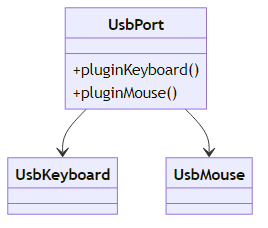
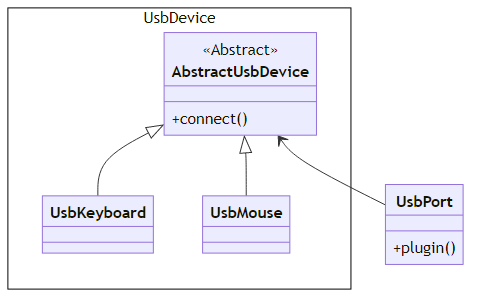
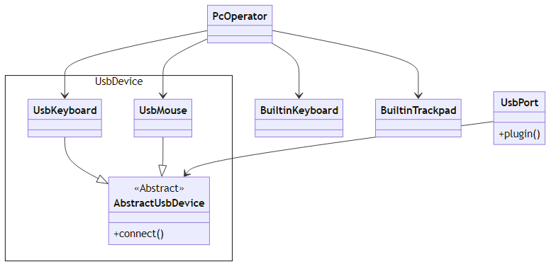
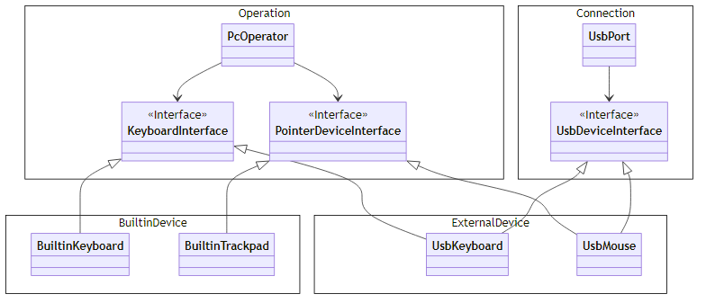
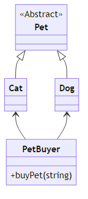
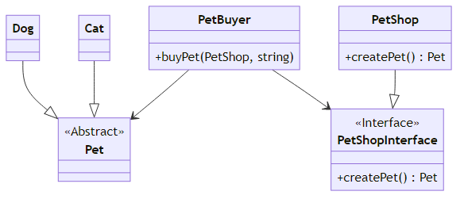
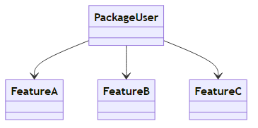
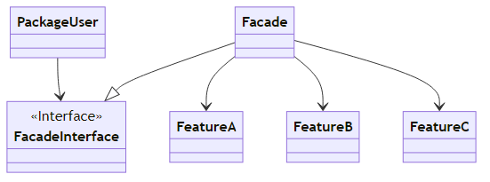
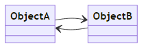
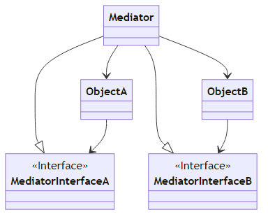

# ちょうぜつソフトウェア設計入門

## 目次
- [クリーンアーキテクチャ](#クリーンアーキテクチャ)
- [パッケージ原則](#パッケージ原則)
- [オブジェクト指向](#オブジェクト指向)
- [UML](#UML)
- [オブジェクト指向原則 SOLID](#オブジェクト指向原則-SOLID)
- [テスト駆動開発](#テスト駆動開発)
- [依存性注入](#依存性注入)
- [デザインパターン](#デザインパターン)
- [アジャイル開発](#アジャイル開発)

## クリーンアーキテクチャ
クリーンアーキテクチャ: アーキテクチャのいいところを抜き出したもの的な。いいとこどりした奴。  
動作自体に貢献はしない。生産性や変更可能性に寄与する。凝集度とか依存性の向きの話。  
1. SRP
2. 依存関係の個数をなるべく減らす
3. 安定度の高いところに依存する

レイヤ
1. ドメインモデル
ほぼ変わらない、客観的に見て事実だよねって言えるモデル
2. ユースケース
利用者のニーズを満たすロジックを満たす部分
3. インターフェースアダプター
所謂コントローラ層
4. インフラストラクチャ
完全に外部との I/O

## パッケージ原則
※ ここで言うパッケージは Java の package feature とは無関係なので注意  
再利用・リリース等価の原則 (Reuse-Release Equivalent Principle, REP): リリースされたものだけを再利用しなさい、再利用させたければリリースしなさい。  
リリースというのは main branch に merge するとかそういうこと。作りかけの部品を使って壊れた！とか言われてもね。リリースするまで待っとけよっていう。  
逆に言うと、リリースされるまで再利用を待てる形で作らなくっちゃあいけない。mock を適当に差しといて、リリースされたら実際に差し替える（再利用する）という感じかな。まあよくある話。
- 全再利用の原則
- 閉鎖性共通の原則

を考える必要がある。
全再利用の原則 (Common Reuse Principle, CRP): 一つのパッケージ（バージョン）に入った変更を、全部受け入れるか全部受け入れないか、atomic に選択しなければならないという原則。かんたんに言えば、分けるべきものは分けなさい。つまり SRP っすね。  
後から混ぜるのは簡単でも、後から分けるのは非常に大変。
閉鎖性共通の原則 (Common Closure Principle, CCP): つまり OCP っすね。  
つまり、パッケージは分けすぎも分けなさすぎもよくない……。  

非循環依存関係の原則 (Acyclic Dependencies Principle, ADP): はい。パッケージ内では許していい。例えば Java の `Object#toString` は `String` に依存してて、 `String` は `Object` の subclass なので依存してて、相互依存だけど、両方 `java.lang` 内なので。こういう密結合はパッケージ内に閉じちゃえばいい。

安定依存の原則 (Stable Dependencies Principle, SDP): はい。クリーンアーキテクチャ自体も言ってるやつ。  
安定度・抽象度等価の原則 (Stable Abstraction Principle, SAP): 安定なら抽象的で、抽象的なら安定である、という原則。  
- abstract class とか interface とか
- ↑ みたいな、抽象的なものにだけ依存するロジック
- 時刻とか配列とか、特定の業務に依存しない概念やそれを扱うもの（Utility みたいなことかな）
- 言語仕様や言語標準ライブラリと同じレベルで業界標準とみなされるもの

2番目はロジックなのに抽象に分類されるのが意外。

## オブジェクト指向
- カプセル化
  - 知識最小の原則
  - デメテルの法則
  - Tell, don't ask.
- 多態性
- 継承／汎化

## UML
まあこの辺は適宜ｇｇれば。

## オブジェクト指向原則 SOLID
S と O は、まあいつものやつ。高凝集度・低結合度ね。
- L: Liskov Substitution Principle リスコフの置換原則: 親ができることが子ができなくなっちゃだめ。下位互換性
- I: Interface Separation Principle インターフェース分離原則: インターフェース版の SRP。OCP かも？

例えば、入出力を担うクラスを入・出のクラスに分解するのではなく、入・出それぞれに対して interface を作って mixin。
USB 接続のキーボードとマウスおよびそれを接続する先である USB ポートを、naive に設計するとこんな感じ。  
  
USB ポートに接続する機器を `UsbPort` に列挙しなきゃいけないのがしんどい。USB フラッシュメモリを追加したいときに `UsbPort` を変更しなきゃいけないのは OCP 違反。  
  
これで `UsbPort` は `AbstractUsbDevice` が具体的に何なのかは無視できるようになった。じゃあ、built-in なキーボードとかポインタ操作デバイスを加え、`PcOperator` のようなクラスを考えたとき、どうか？  
  
`PcOperator` の依存先が多く、中で分岐が必要になる。あとは OCP 違反がやっぱり存在している。例えば、Blutooth のキーボードに対応したい場合。  
  
`PcOperator` からしたら、キー入力デバイスなのか、ポインタ操作デバイスなのか、だけ見分けられればよくて、それが外部デバイスでも内蔵デバイスでも、どうでもいい。  
一方、`UsbPort` からすると USB デバイスでさえあればキー入力デバイスだろうが、ポインタ操作デバイスだろうが、どうでもいい。  
という風に、2つの client が異なる関心を持っているため、それぞれに対して interface 定義をして、mixin で対応する。こういうのができるのが、interface のいいところであり、OOP のいいところ。
- D: Dependency Inversion Principle (DIP) 依存性逆転原則

インターフェース分離原則のところでやった図でいうと、最初の図は `UsbPort` が `UsbKeyboard` に依存している。が、USB ポートの方が安定しているものと考える方が自然であるはずなので、依存の方向は逆であって欲しい。このままだと `UsbPort` を実装する前に `UsbKeyboard` を実装しなきゃいけなくなる。最後の図を見ると、`UsbKeyboard` は `UsbDeviceInterface` に依存しており、package 単位で見たときに依存の方向が逆転している。こんな感じで、抽象の方を先に作って、具体の方を後で作れるように、依存方向を逆転させる、みたいなやつ。  
逆転させなくても問題にならない場合がある。例えば `clamp` 関数とかは `min` `max` に依存するけど、`min` とか `max` とかはめっちゃ抽象的で変わることなんかないでしょって言えるから、依存先として別に不自然でも不適切でもないと言える。

## テスト駆動開発

### 単体テスト
モック: 呼び出される側の偽物。呼ばれた回数と引き渡されたパラメタを assertion することで、テスト対象が本来使うべき機能に正しいパラメタで委譲したことを確認できる。  

### テスト駆動開発の手順
- テスト追加
- 失敗確認
- 最小限の実装: 最小限なのであまり綺麗に書こうとしない。汚くなってきたらリファクタリングで対応する。
- 成功

最初にテストを追加する、**テストファースト**  
BDD 振る舞い駆動開発: TDD から派生した手法。先にテストプログラムで動く仕様を表現してから後で実装をしていく。単体レベルではなく、ユーザが使う機能レベルで行うのが特徴。  
TDD を BDD と比べると、TDD の方が内部設計の美しさに寄与する。

## 依存性注入
例えば、使いたい strategy を自分で new するのは結合度が高くなってしまう。「正しく object を構築したか？」と「正しく object を使用したか？」という複数の責務が負わされ、テスト観点もそうなる。 -> 要するに、詳細への結合は避けて、 interface にのみ依存する形にしたい。依存性逆転の原則がちゃんとできてれば簡単な話かもね？  

### 問題点
パフォーマンスの問題。注入するとなると外から引数で渡すわけで、毎回 new する？ -> これを解決するのが DI コンテナ。平たく言えば cache ですね。

### オートワイヤリング
DI を naive にやろうとすると、object の constructor には引数を追加しなきゃいけないし、object を生成する側は constructor の呼び出しのところで注入する object を new して引数に渡す処理を書かなきゃいけない。つまり、2か所を同期して変更しないと compilation error になる。 -> オートワイヤリングすると、DI コンテナがそこらへん上手くやってくれるようになるので、注入される側に「注入してね！」って書けばいいだけになって嬉しい。Spring framework とかそうだよね。annotation つけるだけってやつ。

### 一つの抽象、一つの具象
interface に対して具象クラスが一つしか存在しないなら、interface なんて要らないんじゃないの？ <- 愚か。interface の存在意義をはき違えている。猛省すべき。多態の総称ではなく package の接続点と考えると……？ DIP ちゃんと理解しようね、という話。

## デザインパターン

### Iterator
まあ、はい。

### Template Method
はい。好き。

### Bridge
継承ツリーが適してない場合に関して、mixin でやるやつ。組み合わせ爆発とかが抑えられてうれしそう。複数の特性軸があって、それぞれが独立な場合とかに効くやつ。多対多の橋渡しって意味で Bridge Pattern らしい。へー。

### Singleton
シングルトン使うことは比較的まれ。でも statc method よりかは増し。でも DI コンテナ使った方が良いよ。参照透過にする。まあこれはあたりまえだ。

### Abstract Factory
  
`PetBuyer#buyPet` は受け取った文字列によって買うペットを分岐するロジックを持つ  
せっかく `Cat` `Dog` は `Pet` という抽象で扱えるようになってるのに、これじゃ意味がない……  
  
これで `PetBuyer` は `Pet` の具象を気にしなくてよくなった！  ……けど？  
依存性の向きは妥当か？`PetBuyer` の買うという動作はほぼ変わらないはず。だがペットの種類の追加とか、そういうのが起きるのは想像に難くない。  
  
依存性逆転した。`PetBuyer` は抽象にしか依存していないため、`Pet` の具象が増えようが何だろうが、正しいことが担保される。`PetBuyer` は `Pet` という抽象を対象として処理を行うのに、ファクトリである `PetShop` は具象になっていたのが問題点であった。「対象が抽象ならファクトリも抽象に」。あとは依存の方向。

### Facade
  
これを  
  
こうじゃ！はい。

### Mediator
  
これを  
  
こうじゃ！　`ObjectA` は `MediatorInterfaceA` を介して `ObjectB` を使って、逆は逆。依存のサイクルが無くなってうれしいね。

### Proxy
まあ、interceptor みたいな。AOP 的と言ってもいいかも？いやそれは誤解を生みそうだけど。

### Decorator
Proxy と似てるけど、違う。Proxy は method を増やしたりはしない。あくまで既存 method の前後に特定の処理を割り込ませるだけ。Decorator は class に対して便利 method を追加するみたいな、そういうことをやるときに使う。

### Adaptor
interface の変換を行う。電圧変換アダプタみたいなもんよな。

### Composit
自分自身を property に持って、再帰的に無限の階層を示せるやつ。ファイルシステムとかそうなってるよね。

### Strategy
Template Method と似てる。けどあっちは継承でなんとかやるやつ。こっちは継承じゃなくて、ある値の指定によっていろいろ変わるやつ。高階関数でも同じことができる。部分適用とかその辺ですね。

### State
ある object が内部に strategy を property として持っており、その object の状態変化に伴って内部の strategy も自動的に切り替えるやつ。ほーん。

### Command
実行内容と実行トリガーを分ける。関数を first class citizen として扱えることと何も違いはなさそう。`Thread#run` に関数渡せるでしょ？渡す関数は実行内容でしょ？でも実行はしてない。トリガーを引くのはあくまで渡された thread 内で行われる。そういうこと。分けてすっきりできる以外にも、処理を queueing しておいてあとから実行する、みたいなこともできるようになる。非同期処理ですね。

### Observer
要するにイベントリスナ。何かイベントが起こったらそれに応じて何かするけど、同期じゃなくていいよね、ってやつ。ログ書くとか。

### Visitor
簡単な例として `List#forEach`。`List` みたいな簡単なやつだったら traverse するのは `for` 書くだけで簡単だけど、じゃあ例えば graph だったらどうか？内部構造の辿り方をそのデータ構造の使用者が知らなくても操作できるようにしておいた方が親切でしょ、という考え。

### デザインパターンとの付き合い方
べき論というよりは、べきでない論の方が強い。Singleton って書いてあったらスレッドセーフなんだな、とか、Mediator とか Facade って書いてあったらここに新規ロジックは何もなくて、委譲してるだけだな、とか、Adaptor って書いてあったらここは interface 変換をしてるだけで業務ロジックなんか書いてないはずだな、とか、Strategy や Visitor って書いてあったら何か特定のデータ値と癒着してないはずだな、とか。そういうのが一目でわかるようになっているプロトコルみたいなものなので、やっちゃいけないことをやってしまうと途端に脆くなるしメリットも薄れる。

## アジャイル開発

### Entity
実体。現実世界の写し取り。PK を持つ。つまり一意性を持つ。

### Value Object
一意性はない。

### Service
注入によって実装を提供するパターンのやつ。まあはい。

### Factory
はい。

### Repository
Factory の中でも Entity の提供に特化したもの。

### ドメイン駆動設計
> モデル駆動設計がユビキタス言語を通じて要求の洗練のフィードバックを受けて育つ、このプロセスのこと

### 偽物の見分け方
アジャイルソフトウェア開発宣言に立ち返って、それに沿っているかを確認する。  
アーキテクチャの安定度分布。毎週ミーティングしてるんだから、重要で安定したモデルはどんどん成長してより安定的になるはずで、逆に変化しやすい事情もわかってくるので、その2つの境界が明確になってくる。逆に、そういう風になってないなら退廃的だよね。

[ホームへ戻る](https://cyan515.github.io/blogs/)
